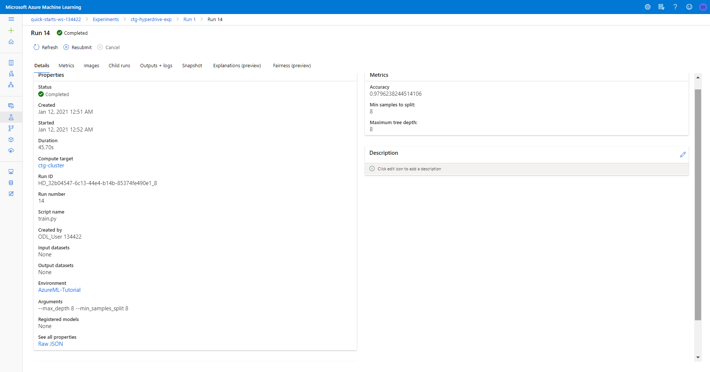
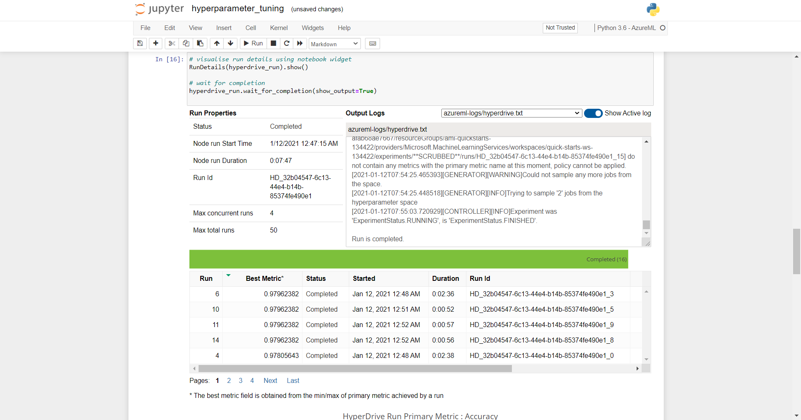
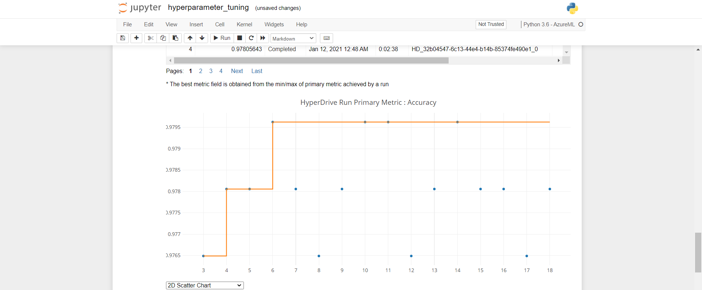

# Capstone Project for Machine Learning in Azure Nanodegree 

## Introduction

This is a capstone project for the Udacity Nanodegree in Machine Learning with Microsoft Azure. The project objective was to develop a machine learning model using a dataset that is external to Azure using both AutoML and Hyperparameter tuning experiments. The best performing model for each experiment is registered, then one of the models is selected for deployment as a web service. 
Finally, the functionality of the deployed model is demonstrated by sending HTTP post requests to the web service and for Inferencing and successfully receiving the scoring results as demonstrated and documented in the project notebooks and in this report.

## Project Overview

According to the WHO, perinatal mortality refers to the number of stillbirths and deaths in the first week of life. It is also called early neonatal mortality. One of the major causes of perinatal mortality is intrapartum complications[[1](https://pubmed.ncbi.nlm.nih.gov/11132590/) ,[2](https://europepmc.org/article/pmc/pmc6822315)]. Fetal cardiotocograph (CTGs) can be used as a monitoring tool to identify high-risk women/fetuses during labor [[1](https://pubmed.ncbi.nlm.nih.gov/11132590/)].

One of the recent research efforts towards addressing this problem was recently published by [Hoodbhoy Z et. al](https://europepmc.org/article/pmc/pmc6822315). The article investigated the precision of machine learning algorithm techniques for identifying high risk fetuses using CTG data. Ten different machine learning classification models were trained using CTG data. Sensistivity, precision and F1 scores for each class and overall accuracy of each model were used to predict the fetal states as one of Normal, Suspect or Pathological (NSP). Their result showed that the XGBoost, Decision tree and Random Forest classifiers predicted the Suspect and Pathological states with a high precision (>96%)on training data and (>92%) on test data.

As an extension of their work, this project was aimed at training machine learning models for predicting fetal risk based on CTG data, using the same dataset and the `AutoML` and `HyperDrive` training capabilities of the Microsoft Azure Machine Learning SDK.  Both experiments were successfully completed and the best performing model (in terms of accuracy metric) for the AutoML experiment was deployed as a web service.  

The `HyperDrive` experiment was aimed at optimising the parameters of a pre-selected machine learning algorithm to achieve a high accuracy machine learning model. 
For this experiment, the decison tree classifier algorithm was used. The `max_depth` and `min_samples_split` paramters of the classifier were tuned resulting in a classification model with >98% accuracy. 

The `AutoML` experiment was used to automatically explore a variety of machine learning algorithms for improved model performance.  The best performing algorithm was selected based on a pre-specified performance metric of accuracy. The result of the the AutoML experiment showed that the `Voting Ensemble` model was the best performing algorithm with a >99% classification accuracy. The AutoML experiment offers the great advantage of exploring multiple algorithms within a shorter time frame compared to the amount of time required to perform similar tasks without automation. 

The best performing model from the AutoML experiment was deployed as a webservice using Azure Container Instance (ACI) and a REST URI was produced. HTTP post requests were successfully sent to the URI for Inferencing.

These tasks were performed using the Azure Machine Learning SDK which allows for more programmatic control of the model training process in Microsoft Azure, and is best suited for process automation.

## Project Set Up and Installation

The project was performed using the Microsoft Azure Machine Learning SDK accessible through the Microsoft Azure Portal that provides resources for training machine learning models. The following sequence of tasks was performed to set-up and complete this project.

1. Logon into the Azure Portal using Microsoft Azure login credentials.

2. Launch the Azure Machine Learning Studio by searching for the Machine Learning Service in the search bar

3. Create a compute cluster named 'ctg-cluster' for running the Jupyter notebooks of the project and wait for completion.

4. Go the Notebook section of the studio and upload the project files (automl.ipynb, hyperparameter_tuning.ipynb, train.py and score.py) into the user project folder.

5. Open the `hyperparamter_tuning.ipynb` notebook and run the individual cells in it to perform the model training experiemnt using hyperdrive.
 
7. Open the `automl.ipynb` notebook and run the first set of individual cells to perform model training using Azure AutoML, and to resigter the best trained model. 
 
8. Run the second set of cells in the `automl.ipynb` notebook to deploy the best AutoML model as a web service, obtain the scoring URI and Authentication key of the deployed model and to send scoring requests to the webservice for inferencing.

9. Delete the service at the end of the experiment.
 

## Dataset

### Overview

An open source Cardiotocographic Dataset available at the [UCI Machine Learning Repository](https://archive.ics.uci.edu/ml/datasets/cardiotocography#) was used in this project.  It consists of 2126 fetal cardiotocograms (CTG) that were automatically procesed and the respective diagnostic features measured. The CTGs were also classified by three expert obstetricians and a consensus classification label was assigned to each of them. Classification was both with respect to a moporphologic pattern (A, B, C, ...) and to fetal states - Normal, Suspect and Pathological (NSP) so that the dataset can be used for either a 10-class experiment or a 3-class experiment. In this project the 3-class experiment predicting the NSP colum labels was performed. The dataset was made available on 2010-09-07 and has 23 attributes as documented in the table below:

 

### Task

The CTG dataset was used to perform two machine learning experiments using `HyperDrive Config` and `AutoMLConfig`. Both experiment use all the features of the CTG measurements to classify a fetal state as either `Normal` (label 1), `Suspect` (label 2) or `Pathologic` (label 3). The best performing model was registered and deployed as a web service. HTTP post requests were sent to the service API for inferencing. The project architecture illustrating the sequence of tasks performed to accomplish the project objective is shown in the figure below:

 

### Access

The dataset is hosted in the same Github respository as the project files and is accessible [here](https://github.com/ijeendu/Capstone-Project/blob/main/CTG.csv).  

The `from_delimited_files('path=URL')` method of the `TabularDatasetFactory` class in Microsoft Azure was used to retrieve the data from the .csv file during model training.

 

## Automated ML

The `AutoMLConfig` Class specifies the configuration for submitting an AutoML machine learning experiment in Azure Machine Learning. It contains and persists the parameters for configuring the experiment run, as well as the training data to be used at run time. An overview of the `automl` settings and configurations as well as their descriptions, used for this experiment are shown below:

 

### Results

The details of the AutoML experiment were accessed using the `RunDetails` widget as shown in the screen shots below.

 

A total of 36 iterations were performed and the corresponding performance values are shown:

 

-- screen shot of best automl model with its paramters the properties from the Notebook

The `Voting Ensemble model` at the 36th iteration with `automl ID` =  was the best performing model with the highest accuracy (>99%) and it was selected as the best model. The best trained model and it's parameters are shown below:

 

The AutoML output alerted that the dataset contained unbalanced classes with the label of the smallest class equal to three. This means that the resulting model could be biased. One way to mitigate this would be to perform a class balancing operation using (Synthetic Minority Oversampling Technique) SMOTE in Azure Machine Learning Studio to improve the quality of the dataset prior to model training. 

## Hyperparameter Tuning

For the Hyperparameter tuning experiment using `HyperDriveConfig`, a decision tree classifier was chosen for model training because it was one of the best performing algorithms reported for the same dataset by [Hoodbhoy Z et. al](https://europepmc.org/article/pmc/pmc6822315).
 
Two major parameters that controls the performance of the decision tree classifier were selected for optimisation: the `max_depth` and `min_samples_split`. The `max_depth` specifies the maximum depth of the tree while the `min_samples_split` specifies the minimum number of samples required to split an internal node. The random sampling method `RandomParameterSampling` was used to sample over the hyperparameter space because it runs faster, supports both discrete and continous hyperparamters, and supports the early termination of low performing runs. Accuracy was used as the primary metric with a maximization objective.

The bandit early stopping policy `BanditPolicy` that terminates runs where the primary metric is not within the specified slack factor/slack amount compared to the best performing run was used to improve computational efficiency. The early policy termination was set to a `slack factor of 0.1` , `evaluation interval of 1` and `delay_evaluation of 5` so that performance is evaluated at the end of each child run.

The `HyperDriveConfig` Class specifies the configuration that defines a HyperDrive run. An overview of the `HyperDrive configuration` including information about hyperparamter space sampling, termination policy, primary metric, estimator and the compute target required to execute the experimental runs is shown below:
 

 

### Results

The best performing model obtained from the hyperparamter tuning experiment had `accuracy > 98%` with model parameters `max_depth = 8` and `min_samples_split =8` as shown in the screen shot below.

 

The run details of the hyperdrive experiment available through `RunDetails` widget is shown in the following screen shots:

 

 

 

The model can be improved by including more model parameters for optimisation or using the grid parameter sampling approach which explores all possible parameter combinations if budget resources are available. Also, other evaluation metrics such as F1 score, Precison and Recall can be used as the primary metric to improve overall model performance.

## Model Deployment

*TODO*: Give an overview of the deployed model and instructions on how to query the endpoint with a sample input.

The `Voting Ensemble` with accuracy > 99% obtained from the `AutoML experiment` was deployed using the Azure Container Instance (ACI) because it had a slightly better performance(>1%) than the Decision tree classifer model trained using the Hyperdrive experiment. he model was successfully deployed as a webservice. An overview of the deployed model is shown in the screen shot below:

 

Following successful deployment, the scoring uri and the primary authentication key was retrieved using the `serivce run` method as shown:

 

Data was sent to the webservice in JSON format in form of HTTP post requests for inferencing. The predicted results were successfully returned as shown:

 

## Screen Recording

A short recording demonstrationg the working machine learning model, its deployment and a sample request sent to the end point together with its response is available [here](https://youtu.be/YrU2s5KBfxg).

## Standout Suggestions

Authentication and Logging were enabled as shown below:

 

## References

1. Dua, D. and Graff, C. (2019). UCI Machine Learning Repository [http://archive.ics.uci.edu/ml]. Irvine, CA: University of California, School of Information and Computer Science.

2. Ayres-de Campos D, Bernardes J, Garrido A, Marques-de-Sá J, Pereira-Leite L. SisPorto 2.0: a program for automated analysis of cardiotocograms. J Matern Fetal Med. 2000 Sep-Oct;9(5):311-8. doi: 10.1002/1520-6661(200009/10)9:5<311::AID-MFM12>3.0.CO;2-9. PMID: 11132590.

3. Hoodbhoy Z, Noman M, Shafique A, Nasim A, Chowdhury D, Hasan B. Use of Machine Learning Algorithms for Prediction of Fetal Risk using Cardiotocographic Data. Int J Appl Basic Med Res. 2019 Oct-Dec;9(4):226-230. doi: 10.4103/ijabmr.IJABMR_370_18. Epub 2019 Oct 11. PMID: 31681548; PMCID: PMC6822315.
